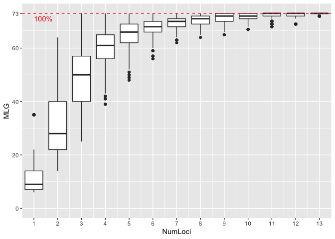

# Genotype accumulation curve

## Loading packages

``` r
# Loading packages
library(tidyverse)
library(polysat)
library(hierfstat)
library(adegenet)
library(poppr)
library(RColorBrewer)
```

## Loading data set

``` r
#initializing
rm(list = ls())

# Loading data set
nameko.raw <- read.csv("MLG_Pmicro_123samples.csv",header=T)

# define locus name
locus.names <- unique(str_sub(colnames(nameko.raw)[-c(1:4)],end=-2))
no.locus <- length(locus.names)

# Convert to 6-digit-numeric coded-genotype
nameko.6_digit.genotype.raw = data.frame()
nameko.6_digit.genotype.raw = data.frame(nameko.raw[,c(1:4)])
for (i in 1:no.locus){
  allele.A.position = 3 + i*2
  allele.B.position = 4 + i*2
  target.loci = locus.names[i]
  nameko.6_digit.genotype.raw = data.frame(nameko.6_digit.genotype.raw, target.loci = paste(formatC(nameko.raw[,allele.A.position],width=3, flag="0"),formatC(nameko.raw[,allele.B.position],width=3, flag="0"),sep=""))
}
colnames(nameko.6_digit.genotype.raw)[-c(1:4)] <- locus.names

#filtering out the sample "K23" because of missing alleles as expressed "NA"
nameko.6_digit.genotype  <- na.omit(nameko.6_digit.genotype.raw)

# Convert to genind
nameko.SSR.genind <- df2genind(nameko.6_digit.genotype[,-c(1:4)],ploidy=2,ncode=3,ind.name=nameko.6_digit.genotype$ID,pop=nameko.6_digit.genotype$Pop)

# Convert to genind
nameko.SSR.subpop.genind <- df2genind(nameko.6_digit.genotype[,-c(1:4)],ploidy=2,ncode=3,ind.name=nameko.6_digit.genotype$ID,pop=nameko.6_digit.genotype$Subpop)

strata(nameko.SSR.genind) <- data.frame(nameko.6_digit.genotype[,c(2:3)])

# Convert to genclone
nameko.SSR.genclone <- as.genclone(nameko.SSR.genind)
nameko.SSR.subpop.genclone <- as.genclone(nameko.SSR.subpop.genind)

#Repeat motif of each of the 14 SSR loci
pinfreps <- c(3,2,3,2,2,2,2,3,3,3,2,2,3,2)

#Clone correction
nameko.SSR.MLG.genind <- clonecorrect(nameko.SSR.genind)
nameko.SSR.MLG.subpop.genind <- clonecorrect(nameko.SSR.subpop.genind)
```

## Plotting Genotype accumulation curve

``` r
# genotype accumulate curve
gac <- genotype_curve(nameko.SSR.genclone, sample = 1000, quiet = TRUE)
```



## Validation of number of multilocus genotypes

``` r
# Defining multilocus genotypes by genetic distance
mlg.ID.poppr <- mlg.filter(nameko.SSR.genclone, threshold = 0.05)
no.mlg.poppr <- length(unique(mlg.ID.poppr))
cat("No. Multilocus genotypes\n")
```

    ## No. Multilocus genotypes

``` r
print(no.mlg.poppr)
```

    ## [1] 73

## Genetic diversity

``` r
poppr(nameko.SSR.subpop.genclone)
```

    ##                       Pop   N MLG  eMLG    SE     H     G lambda   E.5  Hexp
    ## 1                Hokkaido   3   3  3.00 0.000 1.099  3.00  0.667 1.000 0.476
    ## 2                  Aomori   6   6  6.00 0.000 1.792  6.00  0.833 1.000 0.579
    ## 3                   Iwate   2   2  2.00 0.000 0.693  2.00  0.500 1.000 0.238
    ## 4                   Akita   2   2  2.00 0.000 0.693  2.00  0.500 1.000 0.488
    ## 5                  Miyagi   5   3  3.00 0.000 0.950  2.27  0.560 0.802 0.368
    ## 6                Yamagata  14  14 10.00 0.000 2.639 14.00  0.929 1.000 0.553
    ## 7                 Niigata   5   5  5.00 0.000 1.609  5.00  0.800 1.000 0.568
    ## 8               Fukushima  13  11  8.69 0.657 2.311  8.89  0.888 0.869 0.557
    ## 9                  Toyama   1   1  1.00 0.000 0.000  1.00  0.000   NaN 0.500
    ## 10                  Fukui   5   2  2.00 0.000 0.500  1.47  0.320 0.725 0.343
    ## 11                 Nagano   9   7  7.00 0.000 1.889  6.23  0.840 0.932 0.553
    ## 12                Tottori   2   2  2.00 0.000 0.693  2.00  0.500 1.000 0.429
    ## 13                  Kochi   5   2  2.00 0.000 0.500  1.47  0.320 0.725 0.292
    ## 14        Cultivar.indoor  40   8  4.74 0.993 1.667  4.17  0.760 0.737 0.127
    ## 15       Cultivar.outdoor   8   3  3.00 0.000 0.736  1.68  0.406 0.630 0.336
    ## 16 Cultivar.wild.x.indoor   1   1  1.00 0.000 0.000  1.00  0.000   NaN 0.429
    ## 17                  China   1   1  1.00 0.000 0.000  1.00  0.000   NaN 0.500
    ## 18                  Total 122  73  8.96 0.970 3.885 27.77  0.964 0.561 0.474
    ##        Ia    rbarD                       File
    ## 1  -0.462 -0.05556 nameko.SSR.subpop.genclone
    ## 2  -0.107 -0.00853 nameko.SSR.subpop.genclone
    ## 3      NA       NA nameko.SSR.subpop.genclone
    ## 4      NA       NA nameko.SSR.subpop.genclone
    ## 5   6.205  0.77034 nameko.SSR.subpop.genclone
    ## 6  -0.191 -0.01500 nameko.SSR.subpop.genclone
    ## 7   0.243  0.02186 nameko.SSR.subpop.genclone
    ## 8   1.356  0.10713 nameko.SSR.subpop.genclone
    ## 9      NA       NA nameko.SSR.subpop.genclone
    ## 10  7.333  1.00000 nameko.SSR.subpop.genclone
    ## 11  1.690  0.14472 nameko.SSR.subpop.genclone
    ## 12     NA       NA nameko.SSR.subpop.genclone
    ## 13  6.364  1.00000 nameko.SSR.subpop.genclone
    ## 14  0.699  0.17984 nameko.SSR.subpop.genclone
    ## 15  8.775  0.84685 nameko.SSR.subpop.genclone
    ## 16     NA       NA nameko.SSR.subpop.genclone
    ## 17     NA       NA nameko.SSR.subpop.genclone
    ## 18  1.773  0.13786 nameko.SSR.subpop.genclone
