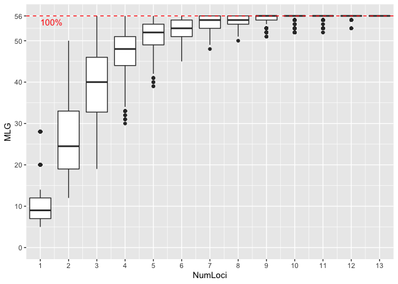

1．Loading packages
-------------------

``` r
# Loading packages
library(polysat)
library(hierfstat)
library(maptools)
library(adegenet)
library(poppr)
library(RColorBrewer)
```

2．Defining SE function
-----------------------

``` r
# Defining SE function
std_mean <- function(x) sd(x)/sqrt(length(x))
```

3．Preparing data set
---------------------

``` r
# Loading data set
Nameko.SSR.table <- read.table("Phmi_genotypes_CVs.3digits.dat", header=TRUE)
Nameko.SSR.pop.list <- Nameko.SSR.table$Pop
Nameko.SSR.pop.list[Nameko.SSR.pop.list!="Cultivar"] <- "Wild"

#Data set including same MLGs
Nameko.SSR.clone.table <- read.table("Phmi_genotypes_clone_CVs.3digits.dat", header=TRUE)

Nameko.SSR.cultivar.table <- subset(Nameko.SSR.table, Nameko.SSR.table$Pop=="Cultivar")
Nameko.SSR.wild.table <- subset(Nameko.SSR.table, Nameko.SSR.table$Pop!="Cultivar")

Nameko.SSR.clone.pop.list <- Nameko.SSR.clone.table$Pop
Nameko.SSR.clone.pop.list[Nameko.SSR.clone.pop.list!="Cultivar"] <- "Wild"

Nameko.SSR.genind <- df2genind(Nameko.SSR.table[,-c(1:4)],ploidy=2,ncode=3,ind.name=Nameko.SSR.table$Sample,pop=Nameko.SSR.pop.list)

Nameko.SSR.wild.genind <- df2genind(Nameko.SSR.wild.table[,-c(1:4)],ploidy=2,ncode=3,ind.name=Nameko.SSR.wild.table$Sample,pop=Nameko.SSR.wild.table$Pop)
Nameko.SSR.cultivar.genind <- df2genind(Nameko.SSR.cultivar.table[,-c(1:4)],ploidy=2,ncode=3,ind.name=Nameko.SSR.cultivar.table$Sample,pop=Nameko.SSR.cultivar.table$Pop)
Nameko.SSR.clone.genind <- df2genind(Nameko.SSR.clone.table[,-c(1:4)],ploidy=2,ncode=3,ind.name=Nameko.SSR.clone.table$Sample,pop=Nameko.SSR.clone.pop.list)

Nameko.SSR.genclone <- as.genclone(Nameko.SSR.genind)
```

4．Genotype accumulation curve
------------------------------

``` r
# genotype accumulate curve
gac <- genotype_curve(Nameko.SSR.genclone, sample = 1000, quiet = TRUE)
```



``` r
poppr.out <- poppr(Nameko.SSR.genclone)

#MX.wild <- popsub(Nameko.SSR.genclone, "Wild")
#ia.wild.out <- ia(MX.wild, sample = 999)
#clonecorrect.MX.wild.out <- MX.wild %>% clonecorrect %>% ia(sample=999)
#ia.MLG.out <- ia(Nameko.SSR.genclone, sample = 999)
```

\#Reference
\#<a href="https://grunwaldlab.github.io/Population_Genetics_in_R/Linkage_disequilibrium.html" class="uri">https://grunwaldlab.github.io/Population_Genetics_in_R/Linkage_disequilibrium.html</a>
