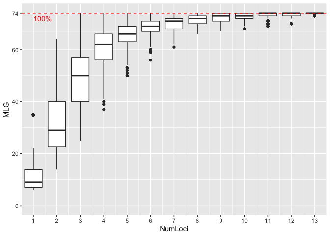

# Genotype accumulation curve

## Loading packages

``` r
# Loading packages
library(tidyverse)
library(polysat)
library(hierfstat)
library(adegenet)
library(poppr)
library(RColorBrewer)
```

## Loading data set

``` r
#initializing
rm(list = ls())

# Loading data set
nameko.raw <- read.csv("MLG_Pmicro_124samples.csv",header=T)

# define locus name
locus.names <- unique(str_sub(colnames(nameko.raw)[-c(1:4)],end=-2))
no.locus <- length(locus.names)

# Convert to 6-digit-numeric coded-genotype
nameko.6_digit.genotype.raw = data.frame()
nameko.6_digit.genotype.raw = data.frame(nameko.raw[,c(1:4)])
for (i in 1:no.locus){
  allele.A.position = 3 + i*2
  allele.B.position = 4 + i*2
  target.loci = locus.names[i]
  nameko.6_digit.genotype.raw = data.frame(nameko.6_digit.genotype.raw, target.loci = paste(formatC(nameko.raw[,allele.A.position],width=3, flag="0"),formatC(nameko.raw[,allele.B.position],width=3, flag="0"),sep=""))
}
colnames(nameko.6_digit.genotype.raw)[-c(1:4)] <- locus.names

#filtering out the sample "K23" because of missing alleles as expressed "NA"
nameko.6_digit.genotype  <- na.omit(nameko.6_digit.genotype.raw)

# Convert to genind
nameko.SSR.genind <- df2genind(nameko.6_digit.genotype[,-c(1:4)],ploidy=2,ncode=3,ind.name=nameko.6_digit.genotype$ID,pop=nameko.6_digit.genotype$Category)

# Convert to genind
nameko.SSR.subpop.genind <- df2genind(nameko.6_digit.genotype[,-c(1:4)],ploidy=2,ncode=3,ind.name=nameko.6_digit.genotype$ID,pop=nameko.6_digit.genotype$Source)

strata(nameko.SSR.genind) <- data.frame(nameko.6_digit.genotype[,c(2:3)])

# Convert to genclone
nameko.SSR.genclone <- as.genclone(nameko.SSR.genind)
nameko.SSR.subpop.genclone <- as.genclone(nameko.SSR.subpop.genind)

#Repeat motif of each of the 14 SSR loci
pinfreps <- c(3,2,3,2,2,2,2,3,3,3,2,2,3,2)

#Clone correction
nameko.SSR.MLG.genind <- clonecorrect(nameko.SSR.genind)
nameko.SSR.MLG.subpop.genind <- clonecorrect(nameko.SSR.subpop.genind)
```

## Plotting Genotype accumulation curve

``` r
# genotype accumulate curve
gac <- genotype_curve(nameko.SSR.genclone, sample = 1000, quiet = TRUE)
```



## Validation of number of multilocus genotypes

``` r
# Defining multilocus genotypes by genetic distance
mlg.ID.poppr <- mlg.filter(nameko.SSR.genclone, threshold = 0.05)
no.mlg.poppr <- length(unique(mlg.ID.poppr))
cat("No. Multilocus genotypes\n")
```

    ## No. Multilocus genotypes

``` r
print(no.mlg.poppr)
```

    ## [1] 74

## Genetic diversity

``` r
poppr(nameko.SSR.subpop.genclone)
```

    ##                            Pop   N MLG  eMLG    SE     H     G lambda   E.5
    ## 1                     Hokkaido   3   3  3.00 0.000 1.099  3.00  0.667 1.000
    ## 2                       Aomori   7   7  7.00 0.000 1.946  7.00  0.857 1.000
    ## 3                        Iwate   2   2  2.00 0.000 0.693  2.00  0.500 1.000
    ## 4                        Akita   2   2  2.00 0.000 0.693  2.00  0.500 1.000
    ## 5                       Miyagi   5   3  3.00 0.000 0.950  2.27  0.560 0.802
    ## 6                     Yamagata  14  14 10.00 0.000 2.639 14.00  0.929 1.000
    ## 7                      Niigata   5   5  5.00 0.000 1.609  5.00  0.800 1.000
    ## 8                    Fukushima  13  11  8.69 0.657 2.311  8.89  0.888 0.869
    ## 9                       Toyama   1   1  1.00 0.000 0.000  1.00  0.000   NaN
    ## 10                       Fukui   5   2  2.00 0.000 0.500  1.47  0.320 0.725
    ## 11                      Nagano   9   7  7.00 0.000 1.889  6.23  0.840 0.932
    ## 12                     Tottori   2   2  2.00 0.000 0.693  2.00  0.500 1.000
    ## 13                       Kochi   5   2  2.00 0.000 0.500  1.47  0.320 0.725
    ## 14        Cultivar.sawdust.JPN  39   8  4.79 0.991 1.678  4.21  0.763 0.738
    ## 15            Cultivar.log.JPN   8   3  3.00 0.000 0.736  1.68  0.406 0.630
    ## 16 Cultivar.sawdust.x.wild.JPN   1   1  1.00 0.000 0.000  1.00  0.000   NaN
    ## 17                Cultivar.CHN   2   2  2.00 0.000 0.693  2.00  0.500 1.000
    ## 18                       Total 123  74  8.97 0.965 3.901 28.17  0.965 0.561
    ##     Hexp      Ia    rbarD                       File
    ## 1  0.476 -0.4615 -0.05556 nameko.SSR.subpop.genclone
    ## 2  0.547 -0.0626 -0.00499 nameko.SSR.subpop.genclone
    ## 3  0.238      NA       NA nameko.SSR.subpop.genclone
    ## 4  0.488      NA       NA nameko.SSR.subpop.genclone
    ## 5  0.368  6.2055  0.77034 nameko.SSR.subpop.genclone
    ## 6  0.553 -0.1906 -0.01500 nameko.SSR.subpop.genclone
    ## 7  0.568  0.2434  0.02186 nameko.SSR.subpop.genclone
    ## 8  0.557  1.3561  0.10713 nameko.SSR.subpop.genclone
    ## 9  0.500      NA       NA nameko.SSR.subpop.genclone
    ## 10 0.343  7.3333  1.00000 nameko.SSR.subpop.genclone
    ## 11 0.553  1.6905  0.14472 nameko.SSR.subpop.genclone
    ## 12 0.429      NA       NA nameko.SSR.subpop.genclone
    ## 13 0.292  6.3636  1.00000 nameko.SSR.subpop.genclone
    ## 14 0.128  0.6951  0.17881 nameko.SSR.subpop.genclone
    ## 15 0.336  8.7753  0.84685 nameko.SSR.subpop.genclone
    ## 16 0.429      NA       NA nameko.SSR.subpop.genclone
    ## 17 0.298      NA       NA nameko.SSR.subpop.genclone
    ## 18 0.473  1.7411  0.13540 nameko.SSR.subpop.genclone
