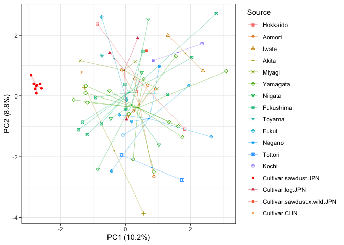
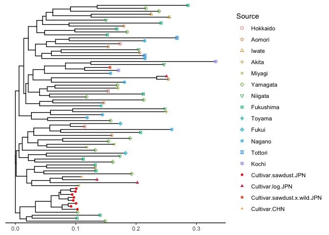

# Principle Component Analysis (PCA) and NJ phylogenic tree

## Loading the packages

``` r
# Loading packages
library(tidyverse)
library(ggplot2)
library(polysat)
library(hierfstat)
library(ape)
library(adegenet)
library(poppr)
library(dartR)
library(magrittr)
library(ggtree)
library(RColorBrewer)
```

## Loading dataset

``` r
#initializing
rm(list = ls())

# Loading data set
nameko.raw <- read.csv("MLG_Pmicro_123samples.csv",header=T)

# define locus name
locus.names <- unique(str_sub(colnames(nameko.raw)[-c(1:4)],end=-2))
no.locus <- length(locus.names)

# Convert to 6-digit-numeric coded-genotype
nameko.6_digit.genotype.raw = data.frame()
nameko.6_digit.genotype.raw = data.frame(nameko.raw[,c(1:4)])
for (i in 1:no.locus){
  allele.A.position = 3 + i*2
  allele.B.position = 4 + i*2
  target.loci = locus.names[i]
  nameko.6_digit.genotype.raw = data.frame(nameko.6_digit.genotype.raw, target.loci = paste(formatC(nameko.raw[,allele.A.position],width=3, flag="0"),formatC(nameko.raw[,allele.B.position],width=3, flag="0"),sep=""))
}
colnames(nameko.6_digit.genotype.raw)[-c(1:4)] <- locus.names


#filtering out the sample "K23" because of missing alleles as expressed "NA"
nameko.6_digit.genotype  <- na.omit(nameko.6_digit.genotype.raw)

# Convert to genind
nameko.SSR.genind <- df2genind(nameko.6_digit.genotype[,-c(1:4)],ploidy=2,ncode=3,ind.name=nameko.6_digit.genotype$ID,pop=nameko.6_digit.genotype$Pop)

# Convert to genind
nameko.SSR.subpop.genind <- df2genind(nameko.6_digit.genotype[,-c(1:4)],ploidy=2,ncode=3,ind.name=nameko.6_digit.genotype$ID,pop=nameko.6_digit.genotype$Subpop)

strata(nameko.SSR.genind) <- data.frame(nameko.6_digit.genotype[,c(2:3)])


# Convert to genclone
nameko.SSR.genclone <- as.genclone(nameko.SSR.genind)

#Repeat motif of each of the 14 SSR loci
pinfreps <- c(3,2,3,2,2,2,2,3,3,3,2,2,3,2)

#Clone correction
nameko.SSR.MLG.genind <- clonecorrect(nameko.SSR.genind)
nameko.SSR.MLG.subpop.genind <- clonecorrect(nameko.SSR.subpop.genind)
```

## PCA

``` r
# Executing PCA
pca.nameko <- dudi.pca(nameko.SSR.MLG.genind, 
    scale=FALSE, scannf=FALSE, nf=3)

pca.nameko.contribute <- numeric(3)
pca.nameko.contribute[1] <- round(100*pca.nameko$eig[1]/sum(pca.nameko$eig),1)
pca.nameko.contribute[2] <- round(100*pca.nameko$eig[2]/sum(pca.nameko$eig),1)
pca.nameko.contribute[3] <- round(100*pca.nameko$eig[3]/sum(pca.nameko$eig),1)
PCA.1.contribute.lab <- str_c("PC1"," (",pca.nameko.contribute[1],"%)")
PCA.2.contribute.lab <- str_c("PC2"," (",pca.nameko.contribute[2],"%)")

names(pca.nameko.contribute) <- c("ContributionRate1","ContributionRate2", "ContributionRate3")

#print(pca.nameko.contribute)

# Plotting PCA: subpopulations
pca.nameko.subpop <- dudi.pca(nameko.SSR.MLG.subpop.genind, 
    scale=FALSE, scannf=FALSE, nf=3)

subpop.list <- levels(nameko.SSR.MLG.subpop.genind@pop)
no.subpop <- length(subpop.list)

subpop.vec <- pop(nameko.SSR.MLG.subpop.genind)
no.clone <- length(subpop.vec)


#Color pallet of ggplot default
ggColorHue <- function(n, l=65) {
  hues <- seq(15, 375, length=n+1)
  hcl(h=hues, l=l, c=100)[1:n]
}

MyCol.ggplot <- ggColorHue(no.subpop)
MyCol.ggplot[14:17] <- c(brewer.pal(11,"Spectral")[1:4])
subpop.list.cultivar.indoor.ID <- which(subpop.list=="Cultivar.indoor")
MyCol.ggplot[subpop.list.cultivar.indoor.ID] <- "red"

# Plotting PCA: subpopulations
pca.scores <- as.data.frame(pca.nameko.subpop$li)
pca.scores$Source <- pop(nameko.SSR.MLG.subpop.genind)

gg <- data.frame(Source=pca.scores$Source, Axis1=pca.scores$Axis1, Axis2=pca.scores$Axis2)
# calculate group centroid locations
centroids <- aggregate(cbind(Axis1,Axis2)~Source,data=gg,mean)
gg <- merge(gg,centroids,by="Source",suffixes=c("",".centroid"))

set.seed(9)
p <- ggplot(gg)
p <- p + geom_point(aes(x=Axis1, y=Axis2, color=Source, shape=Source))
p <- p + geom_point(data=centroids, aes(x=Axis1, y=Axis2, color=Source), size=0.3) 
p <- p + scale_shape_manual(values=c(0,1,2,3,4,5,6,7,8,9,10,11,12,16,17,15,18))
p <- p + scale_color_manual(values=MyCol.ggplot)
p <- p + geom_segment(aes(x=Axis1.centroid, y=Axis2.centroid, xend=Axis1, yend=Axis2, color=Source),size=0.15)
p <- p + theme_bw()
p <- p + xlab(PCA.1.contribute.lab) + ylab(PCA.2.contribute.lab)

p
```



# NJ phylogenic tree

``` r
mic.provesti.dist <- provesti.dist(nameko.SSR.MLG.subpop.genind)
mic.bruvo.dist <- bruvo.dist(nameko.SSR.MLG.subpop.genind,replen = pinfreps)

theTree.nj.bruvo <- mic.bruvo.dist %>%
  nj() %>%    # calculate neighbor-joining tree
  ladderize() # organize branches by clade

#plot(theTree.nj.bruvo,cex=0.7)
write.tree(theTree.nj.bruvo, file="Phmi.bruvo.nj.non_boot.tree.nwk")

set.seed(999)
no.boot <- 1000
theTree.boot.nj.bruvo <- bruvo.boot(nameko.SSR.MLG.subpop.genind, replen = pinfreps, sample = no.boot, tree = "nj", cutoff = 50, quiet = TRUE, showtree=FALSE)
write.tree(theTree.boot.nj.bruvo, file="Phmi.bruvo.nj.boot.tree.nwk")

info <- data.frame(ID=indNames(nameko.SSR.MLG.subpop.genind),Source=pop(nameko.SSR.MLG.subpop.genind))

#plot tree with using ggtree
#https://4va.github.io/biodatasci/r-ggtree.html
#https://guangchuangyu.github.io/ggtree-book/chapter-ggtree.html
Phmi.nj.tree.ggtree.boot <- read.tree("Phmi.bruvo.nj.boot.tree.nwk")
p.tree <- ggtree(Phmi.nj.tree.ggtree.boot) %<+% info + geom_tippoint(aes(color=Source, shape=Source))
p.tree <- p.tree + scale_shape_manual(values=c(0,1,2,3,4,5,6,7,8,9,10,11,12,16,17,15,18))
p.tree <- p.tree + scale_color_manual(values=MyCol.ggplot)
p.tree <- p.tree + theme_tree2()

p.tree
```


