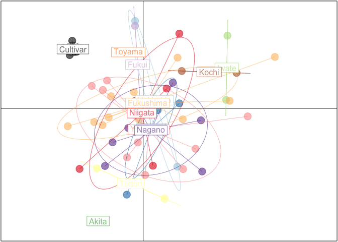

1．Loading packages
-------------------

``` r
# Loading packages
library(polysat)
library(hierfstat)
library(maptools)
library(adegenet)
library(RColorBrewer)
```

2．Loading data set
-------------------

``` r
#allele sizes at Phmi01 and Phmi02 were 100 plus the original because less than 100 sizes could be incorrectly inputted
Nameko.SSR.table <- read.table("Phmi_genotypes_CVs.3digits.dat", header=TRUE)
Nameko.SSR.genind <- df2genind(Nameko.SSR.table[,-c(1:3)],ploidy=2,ncode=3,ind.name=Nameko.SSR.table$Sample,pop=Nameko.SSR.table$Pop)

no.pop <- length(unique(pop(Nameko.SSR.genind)))
#No. wild populations = No. all populations - 1 (No. cultivated populations = １)
no.wild.pop <- length(unique(Nameko.SSR.genind@pop)) -1 

#Repeat motif of each of the 14 SSR loci
pinfreps <- c(3,2,3,2,2,2,2,3,3,3,2,2,3,2)
```

3．Executing PCA
----------------

``` r
pca.Nameko <- dudi.pca(Nameko.SSR.genind, 
    scale=FALSE, scannf=FALSE, nf=3)
pca.Nameko.contribute <- numeric(3)
pca.Nameko.contribute[1] <- pca.Nameko$eig[1]/sum(pca.Nameko$eig)
pca.Nameko.contribute[2] <- pca.Nameko$eig[2]/sum(pca.Nameko$eig)
pca.Nameko.contribute[3] <- pca.Nameko$eig[3]/sum(pca.Nameko$eig)
names(pca.Nameko.contribute) <- c("ContributionRate1","ContributionRate2", "ContributionRate3")
print(pca.Nameko.contribute)
```

    ## ContributionRate1 ContributionRate2 ContributionRate3 
    ##        0.10212823        0.09258563        0.07574115

4．Plotting PCA
---------------

``` r
col.wild =funky(no.wild.pop)
col.wild.cultivar <- c(col.wild,"black")

cols1 <- brewer.pal(8, "Set1")
cols2 <- brewer.pal(7, "Pastel1")
cols <- c(cols1, cols2) 
cols.plot <- cols[1:no.pop]

s.class(pca.Nameko$li,pop(Nameko.SSR.genind),
    xax=1, yax=2,
    col=transp(col.wild.cultivar,0.6),
    axesell=FALSE,
    #cstar=0,
    cpoint=3, grid=FALSE)
```


