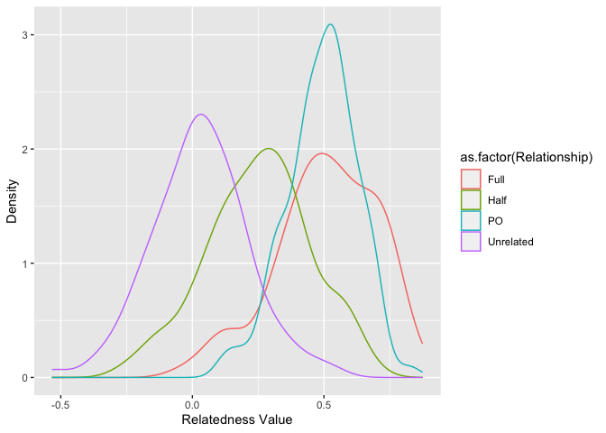
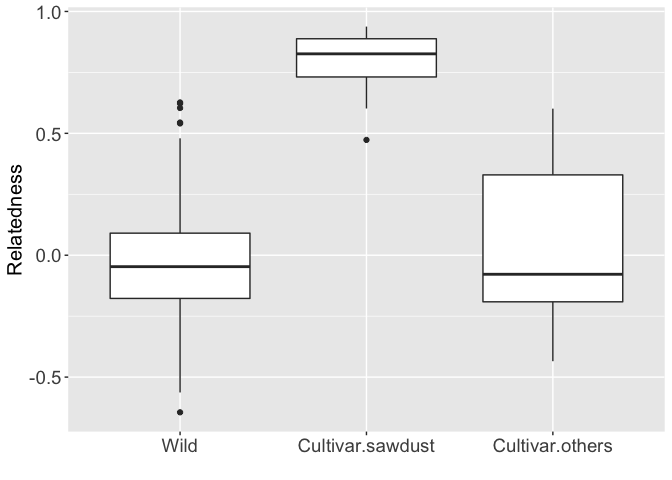

-   [Analysing pairwise relatedness with using the R package
    “related”](#analysing-pairwise-relatedness-with-using-the-r-package-related)
    -   [Loading the packages](#loading-the-packages)
    -   [Loading the dataset](#loading-the-dataset)
    -   [Estimating pairwise
        relatedness](#estimating-pairwise-relatedness)
    -   [Comparing Relatedness
        Estimators](#comparing-relatedness-estimators)
    -   [Conducting simulations](#conducting-simulations)
    -   [Plotting pairwise relatedness](#plotting-pairwise-relatedness)

# Analysing pairwise relatedness with using the R package “related”

## Loading the packages

``` r
# Loading packages
library(related) #Pew et al (2015) Mol Ecol Res | https://doi.org/10.1111/1755-0998.12323
library(ggplot2)
library(adegenet) #handling of genind object
library(poppr) #handling of genclone object
library(stringr)
```

## Loading the dataset

``` r
#initializing
rm(list = ls())

# Loading data set
nameko.raw <- read.csv("MLG_Pmicro_123samples.csv",header=T)

# define locus name
locus.names <- unique(str_sub(colnames(nameko.raw)[-c(1:4)],end=-2))
no.locus <- length(locus.names)

# Convert to 6-digit-numeric coded-genotype
nameko.6_digit.genotype.raw = data.frame()
nameko.6_digit.genotype.raw = data.frame(nameko.raw[,c(1:4)])
for (i in 1:no.locus){
  allele.A.position = 3 + i*2
  allele.B.position = 4 + i*2
  target.loci = locus.names[i]
  nameko.6_digit.genotype.raw = data.frame(nameko.6_digit.genotype.raw, target.loci = paste(formatC(nameko.raw[,allele.A.position],width=3, flag="0"),formatC(nameko.raw[,allele.B.position],width=3, flag="0"),sep=""))
}
colnames(nameko.6_digit.genotype.raw)[-c(1:4)] <- locus.names


#filtering out the sample "K23" because of missing alleles as expressed "NA"
nameko.6_digit.genotype  <- na.omit(nameko.6_digit.genotype.raw)

# Convert to genind object
nameko.SSR.genind <- df2genind(nameko.6_digit.genotype[,-c(1:4)],ploidy=2,ncode=3,ind.name=nameko.6_digit.genotype$ID,pop=nameko.6_digit.genotype$Pop)
strata(nameko.SSR.genind) <- data.frame(nameko.6_digit.genotype[,c(2:3)])

# Convert to genclone object
nameko.SSR.genclone <- as.genclone(nameko.SSR.genind)

# Clone correction
nameko.SSR.MLG.genind <- clonecorrect(nameko.SSR.genind)

nameko.genotype.MLG <- genind2df(nameko.SSR.MLG.genind, usepop = FALSE, oneColPerAll = TRUE)
nameko.genotype.MLG <- data.frame(ID=rownames(nameko.genotype.MLG),nameko.genotype.MLG)

MLG.ID.No.wild <- which(nameko.SSR.MLG.genind@strata$Pop=="Wild")
MLG.ID.No.cultivar <- which(nameko.SSR.MLG.genind@strata$Pop=="Cultivar")
MLG.ID.No.cultivar.indoor <- which(nameko.SSR.MLG.genind@strata$Subpop=="Cultivar.indoor")
MLG.ID.No.cultivar.extra <- setdiff(MLG.ID.No.cultivar, MLG.ID.No.cultivar.indoor)

nameko.genotype.MLG.wild <- nameko.genotype.MLG[MLG.ID.No.wild,]
nameko.genotype.MLG.cultivar <- nameko.genotype.MLG[MLG.ID.No.cultivar,]
nameko.genotype.MLG.cultivar.indoor <- nameko.genotype.MLG[MLG.ID.No.cultivar.indoor,]
nameko.genotype.MLG.cultivar.extra <- nameko.genotype.MLG[MLG.ID.No.cultivar.extra,]

MLG.ID.wild <- nameko.genotype.MLG.wild$ID
MLG.ID.cultivar <- nameko.genotype.MLG.cultivar$ID
MLG.ID.cultivar.indoor <- nameko.genotype.MLG.cultivar.indoor$ID
MLG.ID.cultivar.extra <- setdiff(MLG.ID.cultivar, MLG.ID.cultivar.indoor)

# write out text file to apply the pakacates "related"
write.table(nameko.genotype.MLG, "nameko.MLG.txt", quote=F,row.names=F,col.names=F, append=F)
```

## Estimating pairwise relatedness

``` r
## Load the data file from the above text file.
nameko.Genotype <- readgenotypedata("nameko.MLG.txt")

## Run coancestry function in the packages "related"
related.run.output <- coancestry(nameko.Genotype$gdata, dyadml=1, trioml=1, lynchli=1, lynchrd=1, quellergt=1, ritland =1, wang=1)
```

    ##    user  system elapsed 
    ##  32.396   0.078  32.582 
    ## 
    ## Reading output files into data.frames... Done!

## Comparing Relatedness Estimators

``` r
compareestimators(nameko.Genotype, 100)
```

    ##    user  system elapsed 
    ##  25.596   1.134  27.154 
    ## 
    ## Reading output files into data.frames... Done!
    ## 
    ## Correlation Coefficients Between Observed & Expected Values:
    ## wang     0.759629
    ## lynchli      0.742251
    ## lynchrd      0.754227
    ## quellergt    0.741384


## Conducting simulations

``` r
sim <- familysim(nameko.Genotype$freqs, 100)
output <- coancestry(sim, quellergt=1)
```

    ##    user  system elapsed 
    ##  27.087   1.351  30.099 
    ## 
    ## Reading output files into data.frames... Done!

``` r
simrel <- cleanuprvals(output$relatedness, 100)
relvalues <- simrel[, 10]

#label
label1 <- rep("PO", 100)
label2 <- rep("Full", 100)
label3 <- rep("Half", 100)
label4 <- rep("Unrelated", 100)
labels <- c(label1, label2, label3, label4)

Relationship <- labels
newdata <- as.data.frame(cbind(Relationship, relvalues))
newdata$relvalues <- as.numeric(as.character(newdata$relvalues))
qplot(relvalues, ..density.., data=newdata, geom="density", colour=as.factor(Relationship), xlab="Relatedness Value", ylab="Density")
```



## Plotting pairwise relatedness

``` r
## The Queller & Goodnight estimator (1989) of relatedness was chosen to applied for the following analyses
relatedness.out <- data.frame(ind1.id=related.run.output$related$ind1.id, ind2.id=related.run.output$related$ind2.id, relatedness=related.run.output$related$quellergt)

relatedness.out.wild <- subset(relatedness.out,ind1.id %in% MLG.ID.wild & ind2.id %in% MLG.ID.wild)
no.wild.pair <- nrow(relatedness.out.wild)
relatedness.out.wild <- data.frame(relatedness.out.wild, Within=rep("Wild",no.wild.pair))

relatedness.out.cultivar <- subset(relatedness.out,ind1.id %in% MLG.ID.cultivar & ind2.id %in% MLG.ID.cultivar)
no.cultivar.pair <- nrow(relatedness.out.cultivar)
relatedness.out.cultivar <- data.frame(relatedness.out.cultivar, Within=rep("Cultivar",no.cultivar.pair))

relatedness.out.cultivar.indoor <- subset(relatedness.out,ind1.id %in% MLG.ID.cultivar.indoor & ind2.id %in% MLG.ID.cultivar.indoor)
no.cultivar.indoor.pair <- nrow(relatedness.out.cultivar.indoor)
relatedness.out.cultivar.indoor <- data.frame(relatedness.out.cultivar.indoor, Within=rep("Cultivar.indoor",no.cultivar.indoor.pair))

relatedness.out.cultivar.extra <- subset(relatedness.out,ind1.id %in% MLG.ID.cultivar.extra & ind2.id %in% MLG.ID.cultivar.extra)
no.cultivar.extra.pair <- nrow(relatedness.out.cultivar.extra)

relatedness.out.cultivar.extra <- data.frame(relatedness.out.cultivar.extra, Within=rep("Cultivar.extra",no.cultivar.extra.pair))

relatedness.out.within <- rbind(relatedness.out.wild,relatedness.out.cultivar.extra,relatedness.out.cultivar.indoor)

relatedness.out.within.wild.vs.cultivar.extra <- rbind(relatedness.out.wild,relatedness.out.cultivar.extra)

relatedness.out.within.wild.vs.cultivar.indoor <- rbind(relatedness.out.wild,relatedness.out.cultivar.indoor)
relatedness.out.within.cultivar.extra.vs.cultivar.indoor <- rbind(relatedness.out.cultivar.extra,relatedness.out.cultivar.indoor)


p.boxplot <- ggplot(relatedness.out.within, aes(x=Within,y=relatedness)) + geom_boxplot() + xlab("") + ylab("Relatedness")

p.boxplot
```



``` r
## permutation test
no.permutation <- 1000
permutation.test <- function(treatment, outcome, n){
  distribution=c()
  obs <- diff(tapply(outcome,treatment,mean))
  for(i in 1:n){
    distribution[i]=diff(by(outcome, sample(treatment, length(treatment), FALSE), mean))
  }
  result=sum(abs(distribution) >= abs(obs))/(n)
  return(list(obs, result, distribution))
  }

# wild vs cultivar.extra
wild.vs.cultivar.extra.permu.out <- permutation.test(relatedness.out.within.wild.vs.cultivar.extra$Within, relatedness.out.within.wild.vs.cultivar.extra$relatedness, no.permutation)

# wild vs cultivar.indoor
wild.vs.cultivar.indoor.permu.out <- permutation.test(relatedness.out.within.wild.vs.cultivar.indoor$Within, relatedness.out.within.wild.vs.cultivar.indoor$relatedness, no.permutation)

# cultivar.extra vs cultivar.indoor
cultivar.extra.vs.cultivar.indoor.permu.out <- permutation.test(relatedness.out.within.cultivar.extra.vs.cultivar.indoor$Within, relatedness.out.within.cultivar.extra.vs.cultivar.indoor$relatedness, no.permutation)

# print out P value
cat("P value: wild vs cultivar.extra\n")
```

    ## P value: wild vs cultivar.extra

``` r
print(format(wild.vs.cultivar.extra.permu.out[[2]]),digits=3)
```

    ## [1] "0.201"

``` r
cat("P value: wild vs cultivar.indoor\n")
```

    ## P value: wild vs cultivar.indoor

``` r
print(format(wild.vs.cultivar.indoor.permu.out[[2]]),digits=3)
```

    ## [1] "0"

``` r
cat("P value: cultivar.extra vs cultivar.indoor\n")
```

    ## P value: cultivar.extra vs cultivar.indoor

``` r
print(format(cultivar.extra.vs.cultivar.indoor.permu.out[[2]]),digits=3)
```

    ## [1] "0"
