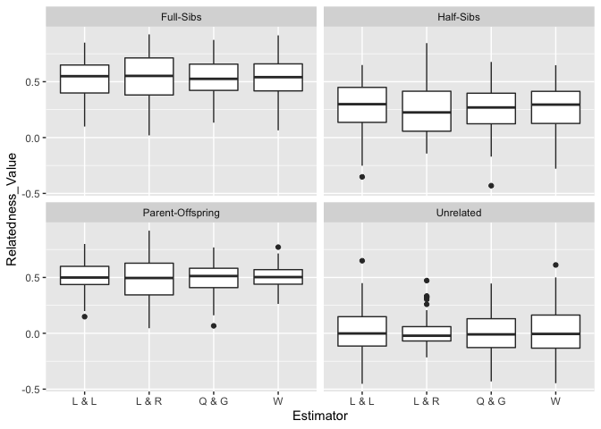

-   [Analysing pairwise relatedness with using the R package
    “related”](#analysing-pairwise-relatedness-with-using-the-r-package-related)
    -   [Loading the packages](#loading-the-packages)
    -   [Loading the dataset](#loading-the-dataset)
    -   [Estimating pairwise
        relatedness](#estimating-pairwise-relatedness)
    -   [Plotting pairwise relatedness](#plotting-pairwise-relatedness)

# Analysing pairwise relatedness with using the R package “related”

## Loading the packages

``` r
# Loading packages
library(related) #Pew et al (2015) Mol Ecol Res | https://doi.org/10.1111/1755-0998.12323
library(ggplot2)
library(adegenet) #handling of genind object
library(poppr) #handling of genclone object
```

## Loading the dataset

``` r
nameko.raw <- read.csv("MLG_Pmicro_123samples.csv", header=T)

nameko.6_digit.genotype.raw = data.frame(nameko.raw[,c(1:4)],
  Phmi01 = paste(formatC(nameko.raw$Phmi01A,width=3, flag="0"),formatC(nameko.raw$Phmi01B,width=3, flag="0"),sep=""),
  Phmi02 = paste(formatC(nameko.raw$Phmi02A,width=3, flag="0"),formatC(nameko.raw$Phmi02B,width=3, flag="0"),sep=""),
  Phmi03 = paste(formatC(nameko.raw$Phmi03A,width=3, flag="0"),formatC(nameko.raw$Phmi03B,width=3, flag="0"),sep=""),
  Phmi05 = paste(formatC(nameko.raw$Phmi05A,width=3, flag="0"),formatC(nameko.raw$Phmi05B,width=3, flag="0"),sep=""),
  Phmi07 = paste(formatC(nameko.raw$Phmi07A,width=3, flag="0"),formatC(nameko.raw$Phmi07B,width=3, flag="0"),sep=""),
  Phmi08 = paste(formatC(nameko.raw$Phmi08A,width=3, flag="0"),formatC(nameko.raw$Phmi08B,width=3, flag="0"),sep=""),
  Phmi09 = paste(formatC(nameko.raw$Phmi09A,width=3, flag="0"),formatC(nameko.raw$Phmi09B,width=3, flag="0"),sep=""),
  Phmi10 = paste(formatC(nameko.raw$Phmi10A,width=3, flag="0"),formatC(nameko.raw$Phmi10B,width=3, flag="0"),sep=""),
  Phmi13 = paste(formatC(nameko.raw$Phmi13A,width=3, flag="0"),formatC(nameko.raw$Phmi13B,width=3, flag="0"),sep=""),
  Phmi14 = paste(formatC(nameko.raw$Phmi14A,width=3, flag="0"),formatC(nameko.raw$Phmi14B,width=3, flag="0"),sep=""),
  Phmi17 = paste(formatC(nameko.raw$Phmi17A,width=3, flag="0"),formatC(nameko.raw$Phmi17B,width=3, flag="0"),sep=""),
  Phmi20 = paste(formatC(nameko.raw$Phmi20A,width=3, flag="0"),formatC(nameko.raw$Phmi20B,width=3, flag="0"),sep=""),
  Phmi23 = paste(formatC(nameko.raw$Phmi23A,width=3, flag="0"),formatC(nameko.raw$Phmi23B,width=3, flag="0"),sep=""),
  Phmi24 = paste(formatC(nameko.raw$Phmi24A,width=3, flag="0"),formatC(nameko.raw$Phmi24B,width=3, flag="0"),sep="")
)

nameko.6_digit.genotype <- nameko.6_digit.genotype.raw[-122,]

# Convert to genind object
nameko.SSR.genind <- df2genind(nameko.6_digit.genotype[,-c(1:4)],ploidy=2,ncode=3,ind.name=nameko.6_digit.genotype$ID,pop=nameko.6_digit.genotype$Pop)
strata(nameko.SSR.genind) <- data.frame(nameko.6_digit.genotype[,c(2:3)])


# Convert to genclone object
nameko.SSR.genclone <- as.genclone(nameko.SSR.genind)

# Clone correction
nameko.SSR.MLG.genind <- clonecorrect(nameko.SSR.genind)

nameko.genotype.MLG <- genind2df(nameko.SSR.MLG.genind, usepop = FALSE, oneColPerAll = TRUE)
nameko.genotype.MLG <- data.frame(ID=rownames(nameko.genotype.MLG),nameko.genotype.MLG)

MLG.ID.no.wild <- which(nameko.SSR.MLG.genind@strata$Pop=="Wild")
MLG.ID.no.cultivar <- which(nameko.SSR.MLG.genind@strata$Pop=="Cultivar")
MLG.ID.no.cultivar.indoor <- which(nameko.SSR.MLG.genind@strata$Subpop=="Cultivar.indoor")
MLG.ID.no.cultivar.extra <- setdiff(MLG.ID.no.cultivar, MLG.ID.no.cultivar.indoor)

nameko.genotype.MLG.wild <- nameko.genotype.MLG[MLG.ID.no.wild,]
nameko.genotype.MLG.cultivar <- nameko.genotype.MLG[MLG.ID.no.cultivar,]
nameko.genotype.MLG.cultivar.indoor <- nameko.genotype.MLG[MLG.ID.no.cultivar.indoor,]
nameko.genotype.MLG.cultivar.extra <- nameko.genotype.MLG[MLG.ID.no.cultivar.extra,]


MLG.ID.wild <- nameko.genotype.MLG.wild$ID
MLG.ID.cultivar <- nameko.genotype.MLG.cultivar$ID
MLG.ID.cultivar.indoor <- nameko.genotype.MLG.cultivar.indoor$ID
MLG.ID.cultivar.extra <- setdiff(MLG.ID.cultivar, MLG.ID.cultivar.indoor)


# writing out dataset for the pakacates "related"
write.table(nameko.genotype.MLG, "nameko.MLG.txt", quote=F,row.names=F,col.names=F, append=F)
```

## Estimating pairwise relatedness

``` r
## Load the data file
nameko.Genotype <- readgenotypedata("nameko.MLG.txt")

## Run 'coancestry' function
related.run.output <- coancestry(nameko.Genotype$gdata, dyadml=1, trioml=1, lynchli=1, lynchrd=1, quellergt=1, ritland =1, wang=1)
```

    ##    user  system elapsed 
    ##  32.600   0.101  32.832 
    ## 
    ## Reading output files into data.frames... Done!

## Plotting pairwise relatedness

``` r
## The Queller & Goodnight estimator (1989) of relatedness was applied the following analyses
relatedness.out <- data.frame(ind1.id=related.run.output$related$ind1.id, ind2.id=related.run.output$related$ind2.id, relatedness=related.run.output$related$quellergt)

relatedness.out.wild <- subset(relatedness.out,ind1.id %in% MLG.ID.wild & ind2.id %in% MLG.ID.wild)
no.wild.pair <- nrow(relatedness.out.wild)
relatedness.out.wild <- data.frame(relatedness.out.wild, Within=rep("Wild",no.wild.pair))

relatedness.out.cultivar <- subset(relatedness.out,ind1.id %in% MLG.ID.cultivar & ind2.id %in% MLG.ID.cultivar)
no.cultivar.pair <- nrow(relatedness.out.cultivar)
relatedness.out.cultivar <- data.frame(relatedness.out.cultivar, Within=rep("Cultivar",no.cultivar.pair))

relatedness.out.cultivar.indoor <- subset(relatedness.out,ind1.id %in% MLG.ID.cultivar.indoor & ind2.id %in% MLG.ID.cultivar.indoor)
no.cultivar.indoor.pair <- nrow(relatedness.out.cultivar.indoor)
relatedness.out.cultivar.indoor <- data.frame(relatedness.out.cultivar.indoor, Within=rep("Cultivar.indoor",no.cultivar.indoor.pair))

relatedness.out.cultivar.extra <- subset(relatedness.out,ind1.id %in% MLG.ID.cultivar.extra & ind2.id %in% MLG.ID.cultivar.extra)
no.cultivar.extra.pair <- nrow(relatedness.out.cultivar.extra)
relatedness.out.cultivar.extra <- data.frame(relatedness.out.cultivar.extra, Within=rep("Cultivar.extra",no.cultivar.extra.pair))

relatedness.out.within <- rbind(relatedness.out.wild,relatedness.out.cultivar.extra,relatedness.out.cultivar.indoor)

p.boxplot <- ggplot(relatedness.out.within, aes(x=Within,y=relatedness)) + geom_boxplot() + xlab("") + ylab("Relatedness")

p.boxplot
```


